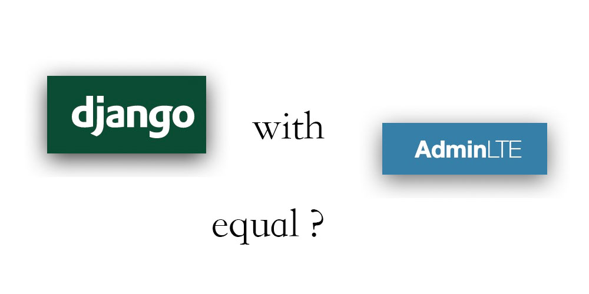
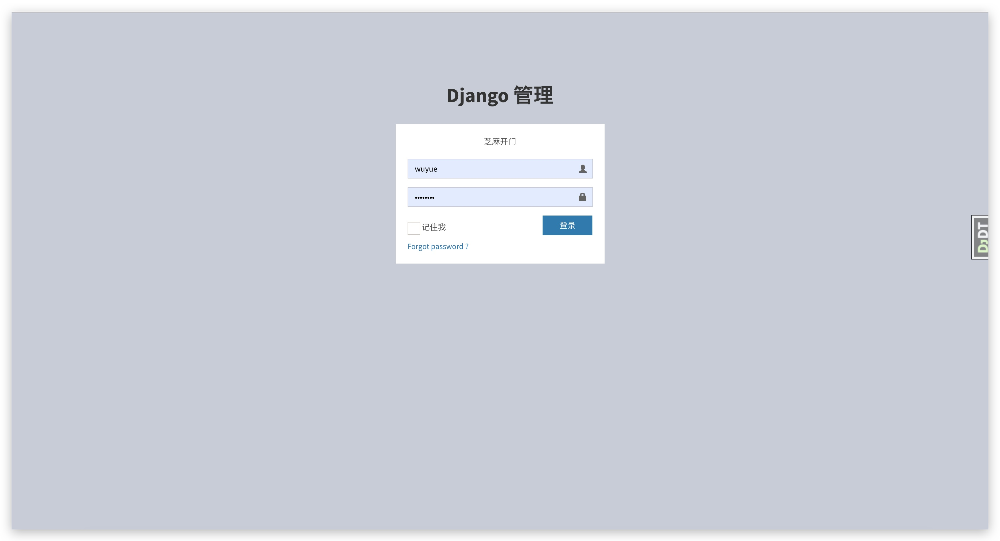
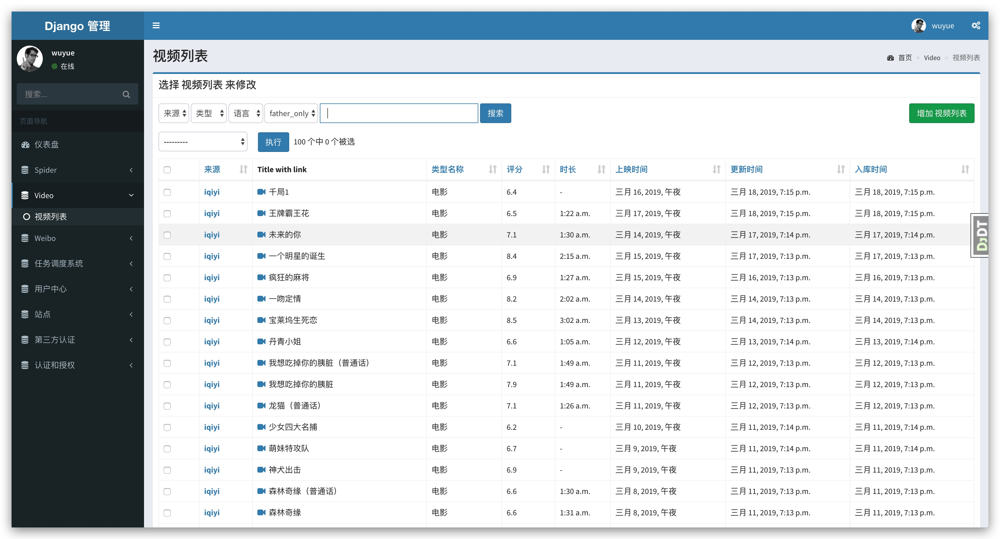
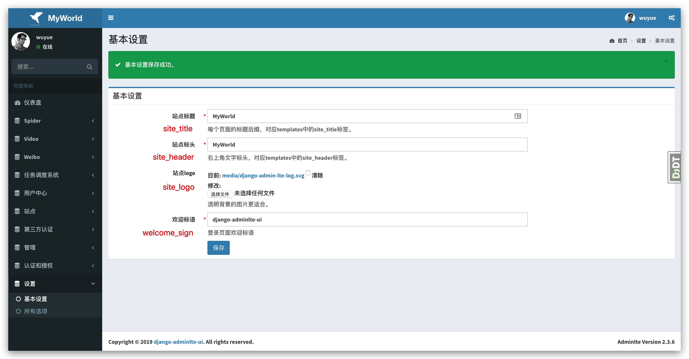

<p align="center">
  <a href="https://github.com/wuyue92tree/django-adminlte-ui">
    
  </a>
</p>

# django-adminlte-ui
[](https://pypi.python.org/pypi/django-adminlte-ui)
[](https://pypi.python.org/pypi/django-adminlte-ui)
[](https://travis-ci.org/wuyue92tree/django-adminlte-ui)
[](https://django-adminlte-ui.readthedocs.io/en/latest/?badge=latest)

django admin theme base on adminlte

adminlte version: 2.3.6

# helper

- if you have good ideas, just contact me.
- if you find some bug, just add an issue.
- if you think this project is good, just star and fork, make it better 🍉.

# install

```
pip install django-adminlte-ui
```

# setup

```
# settings.py

INSTALLED_APPS = [
    'adminlteui',
    'django.contrib.admin',
    'django.contrib.auth',
    'django.contrib.sites',
    'django.contrib.sitemaps',
    'django.contrib.contenttypes',
    'django.contrib.sessions',
    'django.contrib.messages',
    'django.contrib.staticfiles',
    # custom menu base on treebeard
    'treebeard',
    ...
]
```

# Init models
```
python manage.py migrate django_admin_settings
```

# screen shot

## login page


## dashboard


## table list


## form page


## general_option


# Thanks

- [AdminLTE](https://github.com/ColorlibHQ/AdminLTE)
- [django](https://github.com/django/django)
- [django-treebeard](https://github.com/django-treebeard/django-treebeard)
- [django-suit](https://github.com/darklow/django-suit)

# Donate

Your donation take me higher. 🚀

<p align="left">
  <a href="https://github.com/wuyue92tree/django-adminlte-ui">
    
  </a>
</p>
