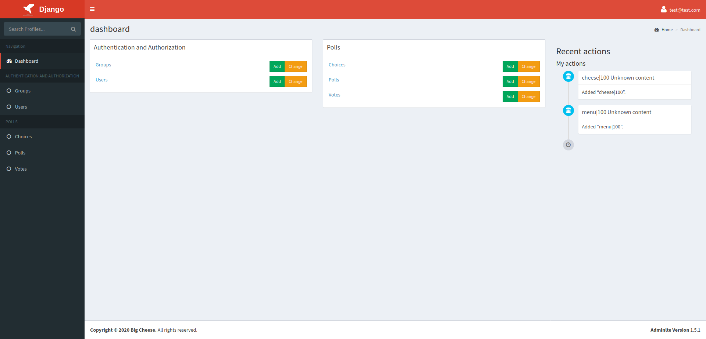
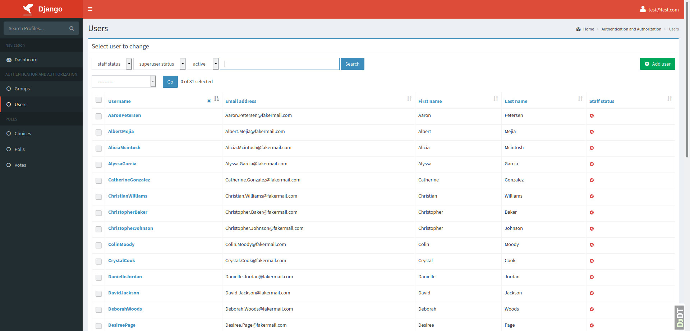
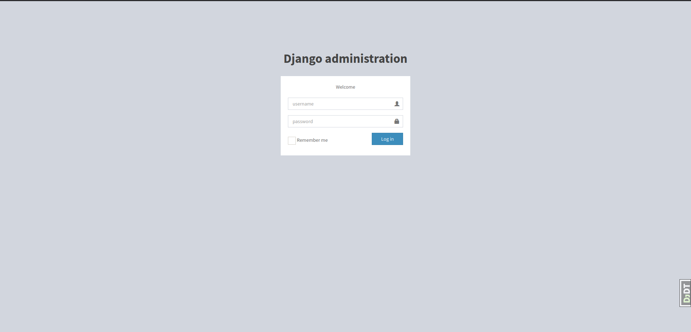

# Django jazzmin (Jazzy Admin)
Drop-in theme for django admin, that utilises AdminLTE 3 & Bootstrap 4 to make yo' admin looky jazzy

Support for custom or generated menus on the left or the top.

## Screenshots

## Dashboard


## List view


## Detail view


## Login view


## Installation
```
pip install django-jazzmin
```

## Setup & configuration

See the [test_app](./tests/test_app/settings.py) for a full implementation

```python
# settings.py

INSTALLED_APPS = [
    # Place before admin
    'jazzmin',
    'django.contrib.admin',
    [...]
]


JAZZMIN_SETTINGS = {
    # title of the window
    'site_title': 'Polls Admin',

    # Title on the login screen
    'site_header': 'Polls',

    # square logo to use for your site, must be present in static files, used for favicon and brand on top left
    'site_logo': None,

    # Welcome text on the login screen
    'welcome_sign': 'Welcome to polls',

    # Copyright on the footer
    'copyright': 'Acme Ltd',

    # The model admin to search from the search bar, search bar omitted if excluded
    'search_model': 'auth.User',

    # Field name on user model that contains avatar image
    'user_avatar': None,

    ############
    # Top Menu #
    ############

    # Links to put along the top menu
    'topmenu_links': [

        # Url that gets reversed (Permissions can be added)
        {'name': 'Home', 'url': 'admin:index', 'permissions': ['auth.view_user']},

        # external url that opens in a new window (Permissions can be added)
        {'name': 'Support', 'url': 'https://github.com/farridav/django-jazzmin/issues', 'new_window': True},

        # model admin to link to (Permissions checked against model)
        {'model': 'auth.User'},

        # App with dropdown menu to all its models pages (Permissions checked against models)
        {'app': 'polls'},
    ],

    #############
    # UI Tweaks #
    #############

    # Relative paths to custom CSS/JS scripts (must be present in static files)
    'custom_css': None,
    'custom_js': None,

    # Whether to show the UI customizer on the sidebar
    'show_ui_builder': False,

    #############
    # Side Menu #
    #############

    # Whether to display the side menu
    'show_sidebar': True,

    # Whether to aut expand the menu
    'navigation_expanded': True,

    # Hide these apps when generating side menu
    'hide_apps': [],

    # Hide these models when generating side menu
    'hide_models': [],

    # List of apps to base side menu ordering off of
    'order_with_respect_to': ['accounts', 'polls'],

    # Custom links to append to app groups, keyed on app name
    'custom_links': {
        'polls': [{
            'name': 'Make Messages', 'url': 'make_messages', 'icon': 'fa-comments',
            'permissions': ['polls.view_polls']
        }]
    },

    # Custom icons per model in the side menu See https://www.fontawesomecheatsheet.com/font-awesome-cheatsheet-5x/
    # for a list of icon classes
    'icons': {
        'auth.user': 'fa-user',
    }
}
```

## UI Tweaks
Jazzmin has a built in UI configurator, mimicked from https://adminlte.io/themes/v3/index3.html, add `'show_ui_builder': True`
to your `JAZZMIN_SETTINGS` dict within your django settings, and there will be an icon in the top right of the screen that
allows you to customise the interface, then generate the code required to persist those changes.

For more advanced tweaks and customisation, _without_ needing to override the admin templates, you can pass a relative path
to a custom CSS or JS file e.g `custom_css': 'common/css/main.css'` or `'custom_js': 'common/js/main.js'` into your jazzmin
settings (Ensure these files can be found by the static file finder).

# Thanks
This was initially a Fork of https://github.com/wuyue92tree/django-adminlte-ui that we refactored so much we thought it
deserved its own package, big thanks to @wuyue92tree for all of his initial hard work, we are still patching into that
project were possible, but this project is taking a slightly different direction.

- Based on AdminLTE 3: https://adminlte.io/
- Using Bootstrap 4: https://getbootstrap.com/
- Using Font Awesome 5: https://fontawesome.com/
