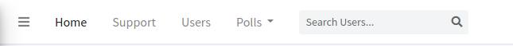
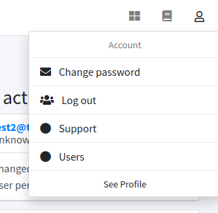
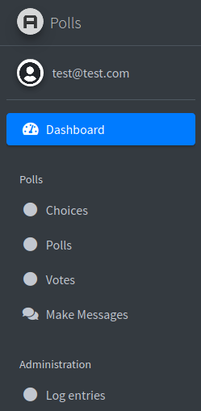
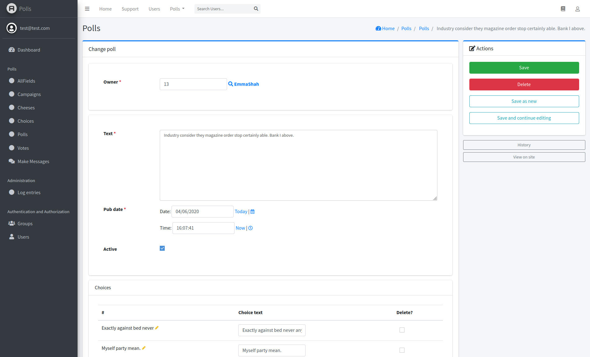
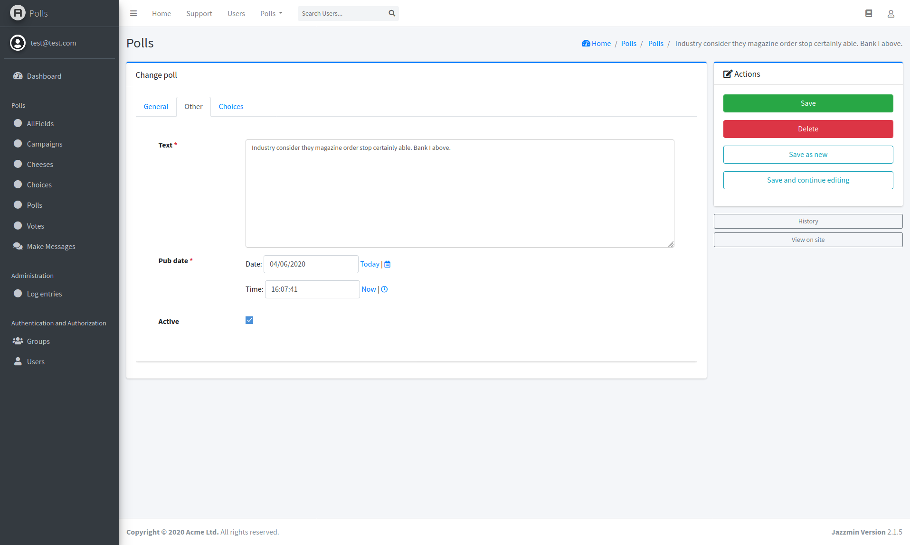
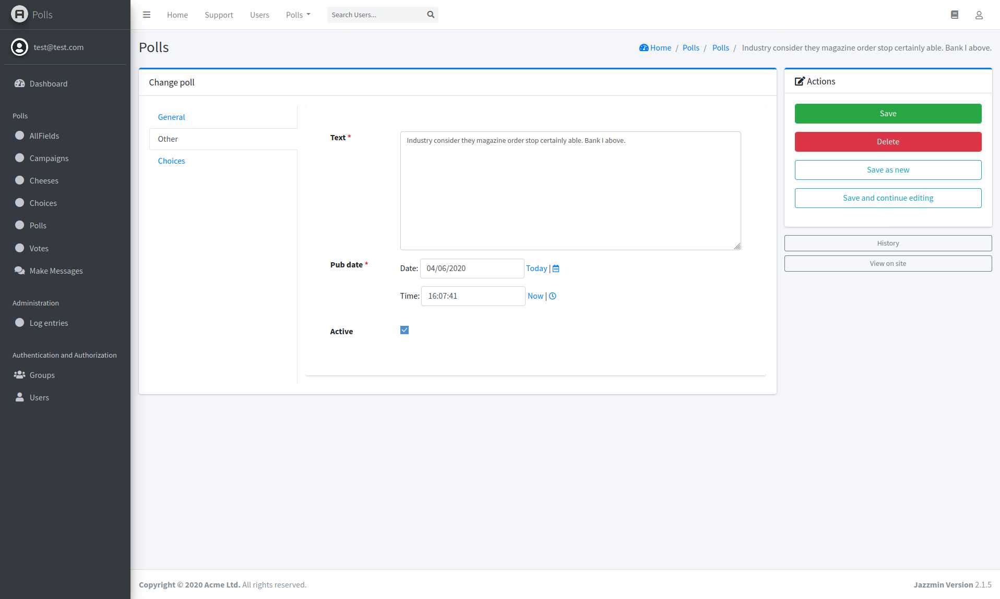
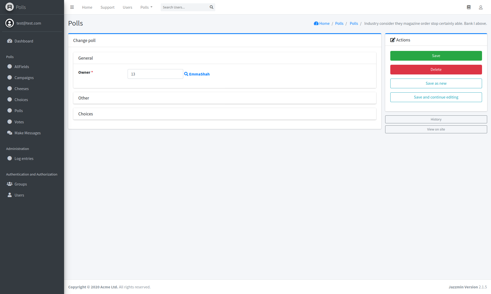
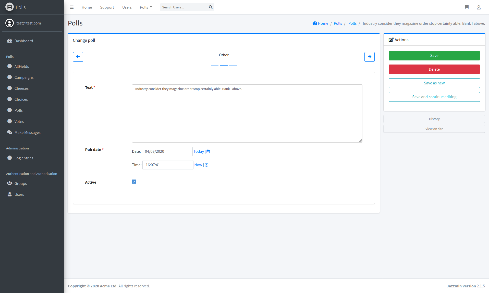
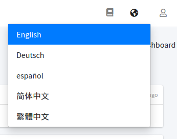
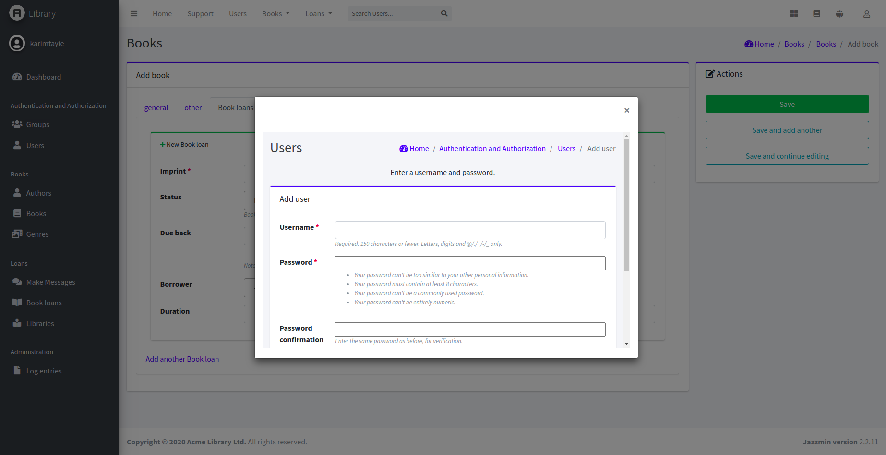

# Configuration

To configure the general behaviour of jazzmin, you can use `JAZZMIN_SETTINGS` within your django settings, below is a 
full example, with some of the more complex items explained below that.

## Full example
```python
JAZZMIN_SETTINGS = {
    # title of the window (Will default to current_admin_site.site_title if absent or None)
    "site_title": "Library Admin",

    # Title on the login screen (19 chars max) (defaults to current_admin_site.site_header if absent or None)
    "site_header": "Library",

    # Title on the brand (19 chars max) (defaults to current_admin_site.site_header if absent or None)
    "site_brand": "Library",

    # Logo to use for your site, must be present in static files, used for brand on top left
    "site_logo": "books/img/logo.png",

    # Logo to use for your site, must be present in static files, used for login form logo (defaults to site_logo)
    "login_logo": None,

    # Logo to use for login form in dark themes (defaults to login_logo)
    "login_logo_dark": None,

    # CSS classes that are applied to the logo above
    "site_logo_classes": "img-circle",

    # Relative path to a favicon for your site, will default to site_logo if absent (ideally 32x32 px)
    "site_icon": None,

    # Welcome text on the login screen
    "welcome_sign": "Welcome to the library",

    # Copyright on the footer
    "copyright": "Acme Library Ltd",

    # List of model admins to search from the search bar, search bar omitted if excluded
    # If you want to use a single search field you dont need to use a list, you can use a simple string 
    "search_model": ["auth.User", "auth.Group"],

    # Field name on user model that contains avatar ImageField/URLField/Charfield or a callable that receives the user
    "user_avatar": None,

    ############
    # Top Menu #
    ############

    # Links to put along the top menu
    "topmenu_links": [

        # Url that gets reversed (Permissions can be added)
        {"name": "Home",  "url": "admin:index", "permissions": ["auth.view_user"]},

        # external url that opens in a new window (Permissions can be added)
        {"name": "Support", "url": "https://github.com/farridav/django-jazzmin/issues", "new_window": True},

        # model admin to link to (Permissions checked against model)
        {"model": "auth.User"},

        # App with dropdown menu to all its models pages (Permissions checked against models)
        {"app": "books"},
    ],

    #############
    # User Menu #
    #############

    # Additional links to include in the user menu on the top right ("app" url type is not allowed)
    "usermenu_links": [
        {"name": "Support", "url": "https://github.com/farridav/django-jazzmin/issues", "new_window": True},
        {"model": "auth.user"}
    ],

    #############
    # Side Menu #
    #############

    # Whether to display the side menu
    "show_sidebar": True,

    # Whether to aut expand the menu
    "navigation_expanded": True,

    # Hide these apps when generating side menu e.g (auth)
    "hide_apps": [],

    # Hide these models when generating side menu (e.g auth.user)
    "hide_models": [],

    # List of apps (and/or models) to base side menu ordering off of (does not need to contain all apps/models)
    "order_with_respect_to": ["auth", "books", "books.author", "books.book"],

    # Custom links to append to app groups, keyed on app name
    "custom_links": {
        "books": [{
            "name": "Make Messages", 
            "url": "make_messages", 
            "icon": "fas fa-comments",
            "permissions": ["books.view_book"]
        }]
    },

    # Custom icons for side menu apps/models See https://fontawesome.com/icons?d=gallery&m=free&v=5.0.0,5.0.1,5.0.10,5.0.11,5.0.12,5.0.13,5.0.2,5.0.3,5.0.4,5.0.5,5.0.6,5.0.7,5.0.8,5.0.9,5.1.0,5.1.1,5.2.0,5.3.0,5.3.1,5.4.0,5.4.1,5.4.2,5.13.0,5.12.0,5.11.2,5.11.1,5.10.0,5.9.0,5.8.2,5.8.1,5.7.2,5.7.1,5.7.0,5.6.3,5.5.0,5.4.2
    # for the full list of 5.13.0 free icon classes
    "icons": {
        "auth": "fas fa-users-cog",
        "auth.user": "fas fa-user",
        "auth.Group": "fas fa-users",
    },
    # Icons that are used when one is not manually specified
    "default_icon_parents": "fas fa-chevron-circle-right",
    "default_icon_children": "fas fa-circle",

    #################
    # Related Modal #
    #################
    # Use modals instead of popups
    "related_modal_active": False,

    #############
    # UI Tweaks #
    #############
    # Relative paths to custom CSS/JS scripts (must be present in static files)
    "custom_css": None,
    "custom_js": None,
    # Whether to link font from fonts.googleapis.com (use custom_css to supply font otherwise)
    "use_google_fonts_cdn": True,
    # Whether to show the UI customizer on the sidebar
    "show_ui_builder": False,

    ###############
    # Change view #
    ###############
    # Render out the change view as a single form, or in tabs, current options are
    # - single
    # - horizontal_tabs (default)
    # - vertical_tabs
    # - collapsible
    # - carousel
    "changeform_format": "horizontal_tabs",
    # override change forms on a per modeladmin basis
    "changeform_format_overrides": {"auth.user": "collapsible", "auth.group": "vertical_tabs"},
    # Add a language dropdown into the admin
    "language_chooser": True,
}
```

## Top menu



You can enable the top menu by specifying `"topmenu_links"` in your `JAZZMIN_SETTINGS`, this is a list made up of one of:

 - app (creates a dropdown of modeladmin links)
 - model (creates a link to a modeladmin)
 - url (url name, or absolute link)

The top menu can be styled with the UI Customiser (See below)

## User menu
You can add links to the user menu on the top right of the screen using the `"usermenu_links"` settings key, the format 
of these links is the same as with top menu (above), though submenus via "app" are not currently supported and will not 
be rendered.


    
## Side menu



### How its generated

The side menu gets a list of all installed apps and their models that have admin classes, and creates a tree of apps and 
links to model admin pages.

You can omit apps, or models from this generated menu, using `hide_apps` or `hide_models` where app is like `auth` and 
model is like `auth.user`

Ordering of the menu can be done using `order_with_respect_to`, which is a list of apps/models/custom links you want to 
base  the ordering off of, it can be a full, or partial list, some examples:

```
# Order the auth app before the books app, other apps will be alphabetically placed after these
"order_with_respect_to": ["auth", "books"],

# Keep the same app ordering as above, but also order choice and book model links within the books app
"order_with_respect_to": ["auth", "books", "books.author", "books.book"],

# Just make sure auth is first
"order_with_respect_to": ["auth"],

# Order apps automatically, but make sure choice and book admin links are first within the books app
"order_with_respect_to": ["books.author", "books.book"],

# Place our choice model admin link and our custom link first within the books app (Note: custom link name used for order key)
"order_with_respect_to": ["books.author", "Make Messages"],

# do nothing
"order_with_respect_to": [],

# Still do nothing
"order_with_respect_to": ["doesnt_exist"],
```

Currently, custom links (See below) cannot be ordered

### Side menu custom links

Custom links can be added using `custom_links`, this is a dictionary of links, keyed on the app they will live under. 
Example:

    "custom_links": {
        "books": [{
            # Any Name you like
            "name": "Make Messages",                
            
            # url name e.g `admin:index`, relative urls e.g `/admin/index` or absolute urls e.g `https://domain.com/admin/index`
            "url": "make_messages",                 
            
            # any font-awesome icon, see list here https://fontawesome.com/icons?d=gallery&m=free&v=5.0.0,5.0.1,5.0.10,5.0.11,5.0.12,5.0.13,5.0.2,5.0.3,5.0.4,5.0.5,5.0.6,5.0.7,5.0.8,5.0.9,5.1.0,5.1.1,5.2.0,5.3.0,5.3.1,5.4.0,5.4.1,5.4.2,5.13.0,5.12.0,5.11.2,5.11.1,5.10.0,5.9.0,5.8.2,5.8.1,5.7.2,5.7.1,5.7.0,5.6.3,5.5.0,5.4.2 (optional)
            "icon": "fas fa-comments",                  
            
            # a list of permissions the user must have to see this link (optional)
            "permissions": ["books.view_book"]     
        }]
    },

#### note
The app list you generate for the side menu, is shared with the dashboard, so any changes you make to it, will be reflected there

## Change form templates
We have a few different styles for a model admins change form controlled via the `changeform_format`, this can be applied 
globally via `changeform_format`, and overriden on a per model basis using `changeform_format_overrides`, which accepts 
a dictionary mapping of model names to changeform templates e.g:

    "changeform_format": "horizontal_tabs",
    # override change forms on a per modeladmin basis
    "changeform_format_overrides": {"auth.user": "collapsible", "auth.group": "vertical_tabs"},

Will use `horizontal_tabs` throughout the admin, but use the `collapsible` template on the user model admin, and 
`vertical_tabs` on the group model admin.

The default style is vertical tabs, *unless* you have no fieldsets and no inlines, in which case you will get the basic single form 
rendered out, See [Django docs on fieldset](https://docs.djangoproject.com/en/dev/ref/contrib/admin/#django.contrib.admin.ModelAdmin.fieldsets) 
on how to add fieldsets to your admin classes.

See below for the different styles:

### Single page (`single`)
Render the form out in one page, including inlines, plain and simple, closest to the original Django admin change form



### Horizontal tabs (`horizontal_tabs`)
Puts all fieldsets and inlines into tab panes with horizontal nav tab controls, this is the default view for change 
forms that have fieldsets. or an inline



### Vertical tabs (`vertical_tabs`)
Puts each fieldset or inline in a separate pane, controlled by vertical tabs on the left hand side.

Future enhancement: Allow tabs to be on the left or right



### Collapsible (`collapsible`)
Puts all fieldsets and inlines in bootstrap collapsibles in an collapsible, allows many collapsibles to be open at the 
same time, the first collapsible is opened



### Carousel (`carousel`)
Puts fieldsets and inlines into a bootstrap carousel, and allows paginaton with previous/next buttons, as well as an indicators.



## Ordering of page content
If you want to order the sections within your pages, you can specify `jazzmin_section_order` on your model admin class e.g:

```python
@admin.register(Book)
class BookAdmin(admin.ModelAdmin):
    resource_class = BookResource
    fieldsets = (
        ("general", {"fields": ("title", "author", "library")}),
        ("other", {"fields": ("genre", "summary", "isbn", "published_on")}),
    )
    inlines = (BookLoanInline,)

    # Order the sections within the change form
    jazzmin_section_order = ("book loans", "general", "other")
```

## Filter perfomance
If your filter will contain a lot of options, like when you use M2M filter or it's a big filter itself, then rendering every option can hurt user perfomance. This is solved by providing `filter_input_length` dictionary with filter name as the key and the value will determine how much characters should be entered before rendering options.

```python
@admin.register(Book)
class BookAdmin(admin.ModelAdmin):
    resource_class = BookResource
    fieldsets = (
        ("general", {"fields": ("title", "author", "library")}),
        ("other", {"fields": ("genre", "summary", "isbn", "published_on")}),
    )
    list_filter = ("title",)

    # Render filtered options only after 5 characters were entered
    filter_input_length = {
        "title": 5,
    }
```

## Language Chooser
You can enable a language chooser dropdown using `"language_chooser": True` in your `JAZZMIN_SETTINGS`, we mainly use this for 
assisting with translations, but it could be of use to some people in their admin site.

To make proper use of this, please ensure you have internationalisation setup properly, See [https://docs.djangoproject.com/en/3.1/topics/i18n/translation/](https://docs.djangoproject.com/en/3.1/topics/i18n/translation/)

Namely:

- i18n urls for your admin
- `LocaleMiddleware` is used, and in the right place
- `LOCALE_DIRS` is setup
- `LANGUAGES` have been defined

See our [test app settings](https://github.com/farridav/django-jazzmin/tree/master/tests/test_app/library/settings.py) 
for a practical example.



## Related Modal
Render django related popups inside a modal using `"related_modal_active": True` instead of the old popup window, 
defaults to `False`



### Adding extra actions to model's form view

Add a template for your model on your main template directory, 
e.g [app/templates/admin/app_name/model_name/submit_line.html](https://github.com/farridav/django-jazzmin/tree/master/tests/test_app/library/books/templates/admin/loans/bookloan/submit_line.html)

```djangotemplate
{# extends "admin/submit_line.html" #}

{# block extra-actions #}

{# For a simple link #}
<div class="form-group">
    <a href="/some/url" class="btn btn-outline-info form-control">Some Action</a>
</div>

{# Or, to process this with form submission #}
<div class="form-group">
    <input type="submit" class="btn btn-outline-info form-control" value="SomeAction" name="_your_action">
</div>
{# endblock #}
```

If you are adding a button that needs processing with the form, e.g (Save and send) you will need to add the
following to your admin class:

```python
def response_change(self, request, obj):
    ret = super().response_change(request, obj)
    if '_your_action' in request.POST:
        # Do something
        pass
    return ret
```
    
The implementation might change slightly if your wanting to perform an action on add, or delete, for those, you can
override the response_add of response_delete methods instead/as well.
