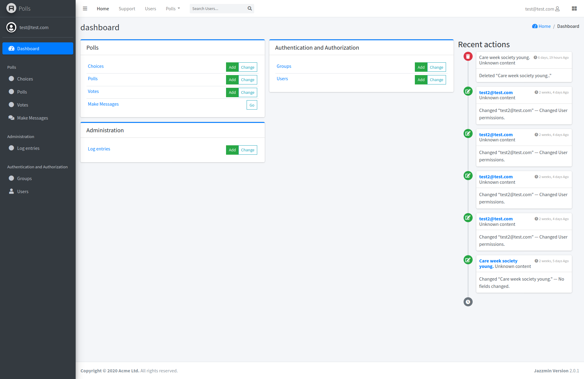
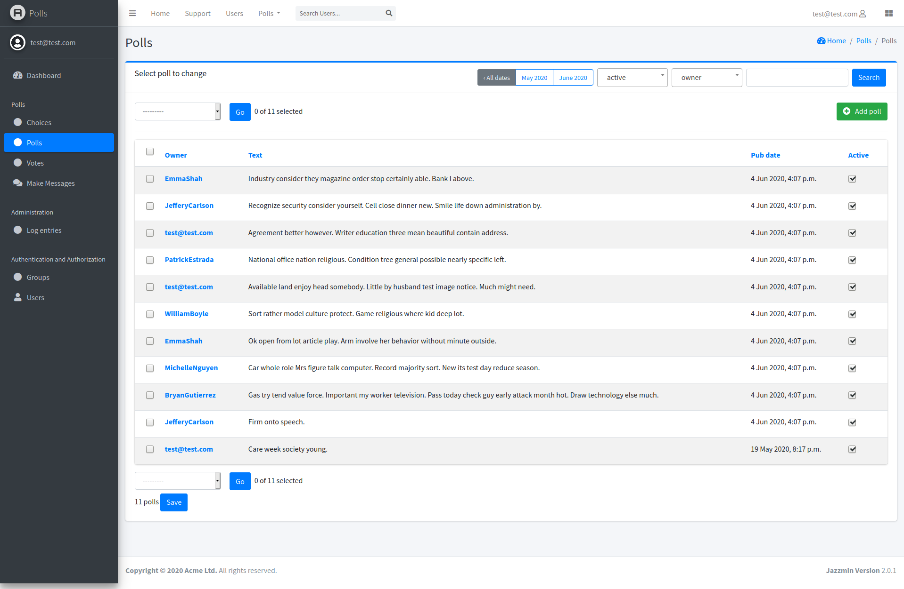
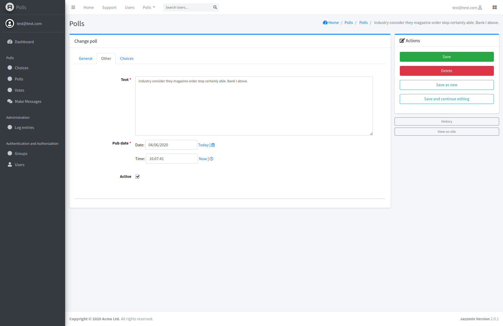
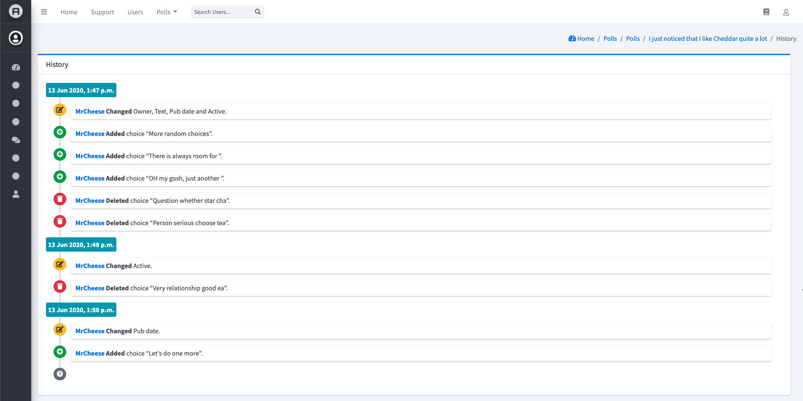
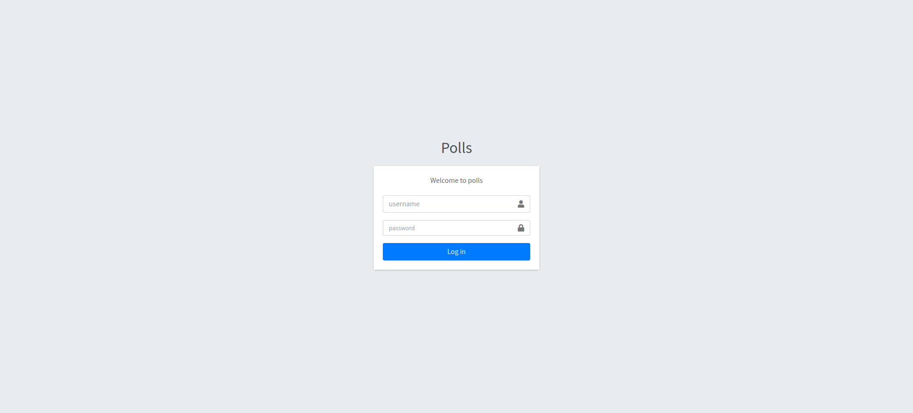
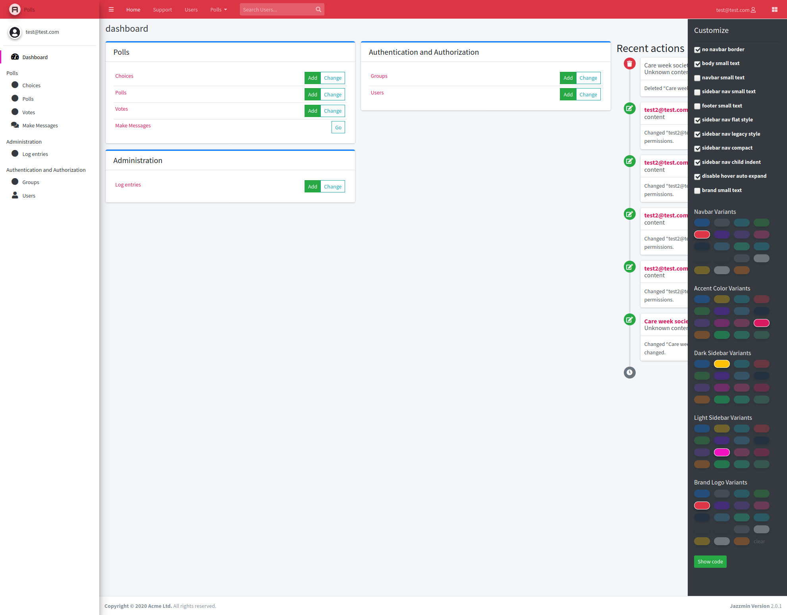
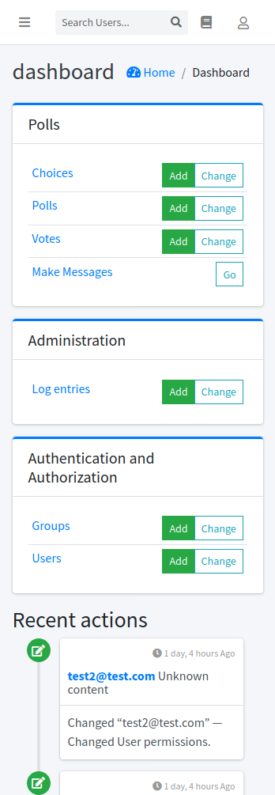
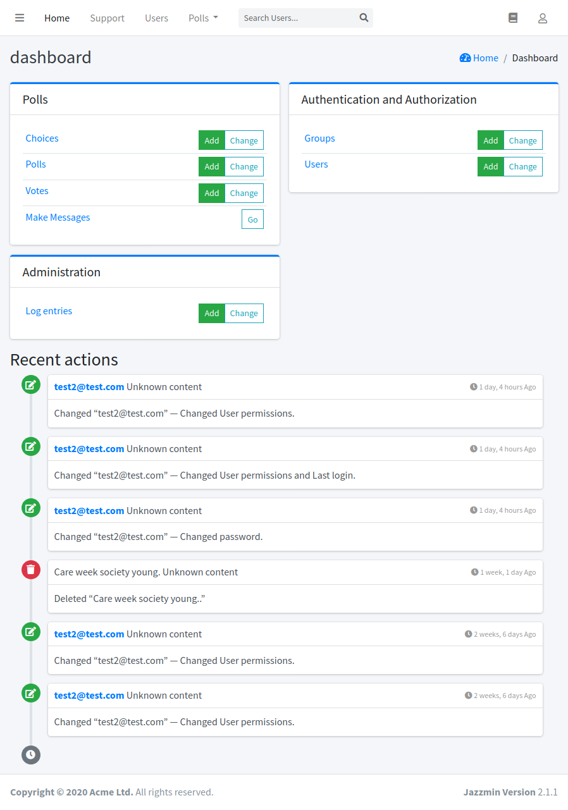
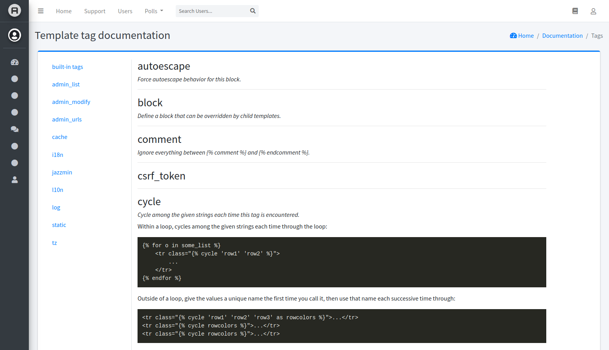

# Jazzmin

Welcome to Jazzmin, intended as a drop-in app to jazz up your django admin site, with plenty of things you can easily 
customise, including a built-in UI customizer 

## Features

- Drop-in admin skin, all configuration optional
- Select2 drop-downs
- Bootstrap 4 & AdminLTE UI components
- Search bar for any given model admin
- Modal windows instead of popups
- Customisable side menu
- Customisable top menu
- Customisable user menu
- Responsive
- Customisable UI (via Live UI changes, or custom CSS/JS)
- Based on the latest [adminlte](https://adminlte.io/) + [bootstrap](https://getbootstrap.com/)

## Demo
Live demo [https://django-jazzmin.herokuapp.com/admin](https://django-jazzmin.herokuapp.com/admin)

> **Username**: test@test.com

> **Password**: test

*Note: Data resets nightly*

## Screenshots

### Dashboard

### List view

### Detail view

### History page

### Modal windows

### Login view

### UI Customiser

### Mobile layout

### Tablet layout

### Admin docs (if installed)

## Thanks
This was initially a Fork of https://github.com/wuyue92tree/django-adminlte-ui that we refactored so much we thought it
deserved its own package, big thanks to @wuyue92tree for all of his initial hard work, we are still patching into that
project were possible, but this project is taking a slightly different direction.

- Based on AdminLTE 3: https://adminlte.io/
- Using Bootstrap 4: https://getbootstrap.com/
- Using Font Awesome 5: https://fontawesome.com/
