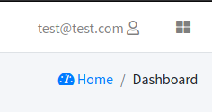
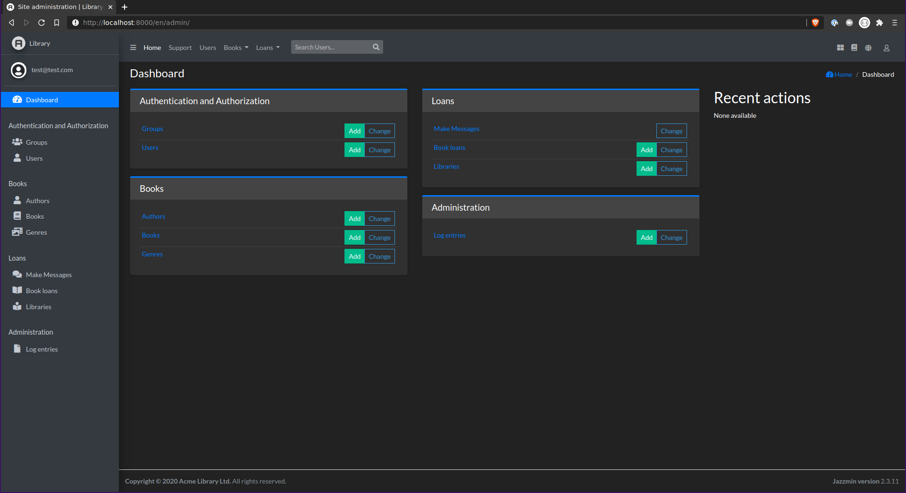
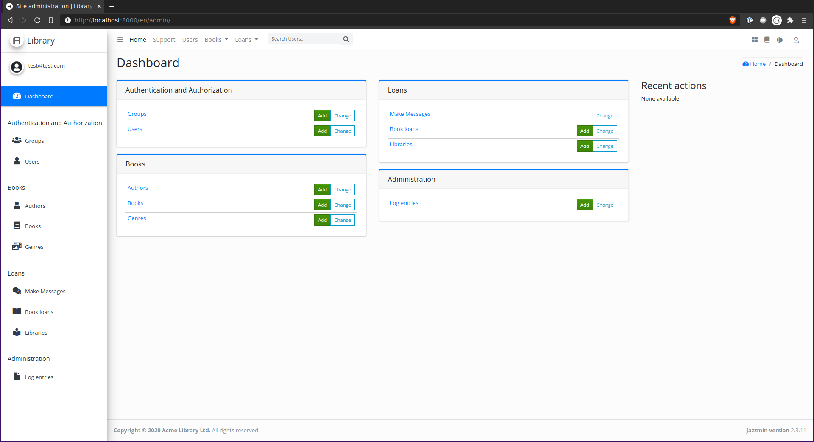
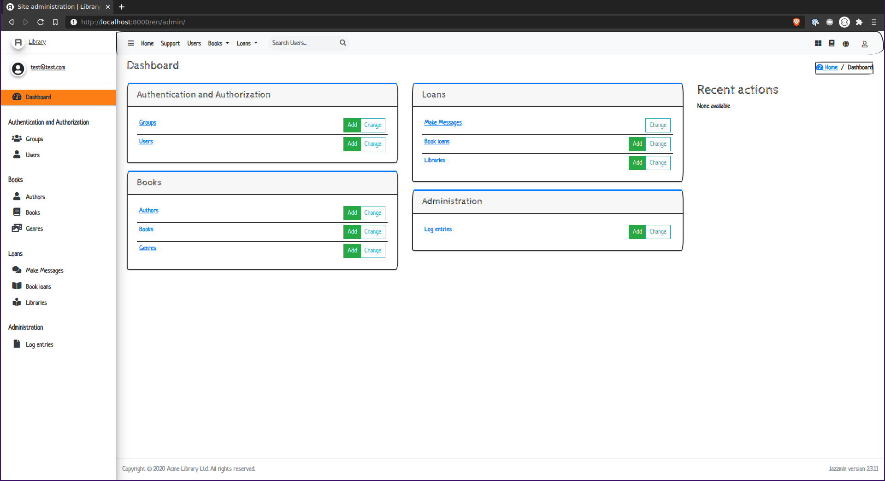
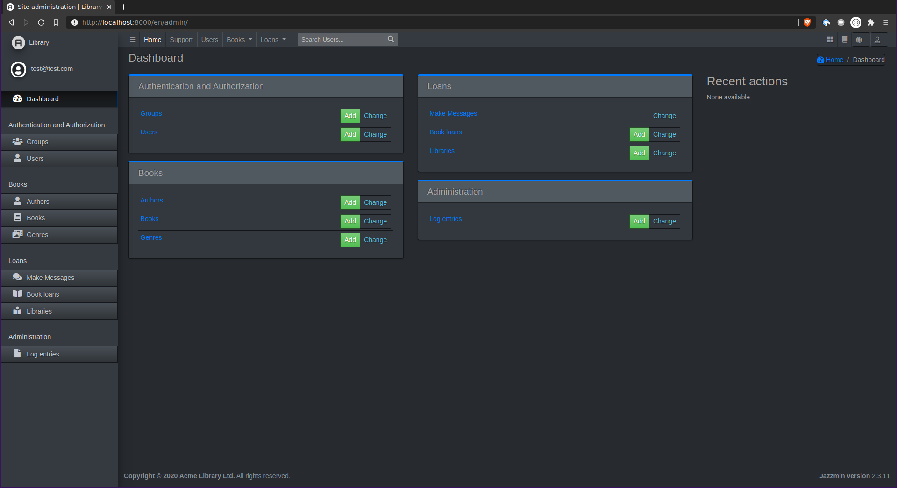

# UI Tweaks

There are various things you can do to change the look and feel of your admin when using jazzmin, some are structural 
changes 

### UI Customizer

Jazzmin has a built in UI configurator, mimicked from [adminlte demo](https://adminlte.io/themes/v3/index3.html), 
that allows you to customise parts of the interface interactively.

To enable this, add `"show_ui_builder": True` to your `JAZZMIN_SETTINGS` and there will be an icon in the top right of 
the screen that allows you to customise the interface.



When your happy with your customisations, press the "Show Code" button, and it will give you a code snippet to put 
into your settings that will persist these customisations beyond page refresh.

### Theming
With the ui customiser enabled (see above), you can try out different bootswatch themes, and combine the theme with our 
other UI tweaks.

Here are some examples of the available themes in action:

#### Darkly


#### Simplex


#### Sketchy


#### Slate


#### More
We have Lots of themes to choose from, they can be set directly in your `JAZZMIN_UI_TWEAKS['theme'] = 'darkly'`

See [https://bootswatch.com/](https://bootswatch.com/) for a full list of themes we currently have 

### DIY with custom CSS/JS

If there are things you need to do with CSS/JS, but want to avoid overriding the templates yourself, you can include a 
custom CSS and/or JS file, just pass a relative path to your files e.g:

```
"custom_css": "common/css/main.css",
"custom_js": "common/js/main.js"
 ```

Into your jazzmin settings (Ensure these files can be found by the static file finder)
